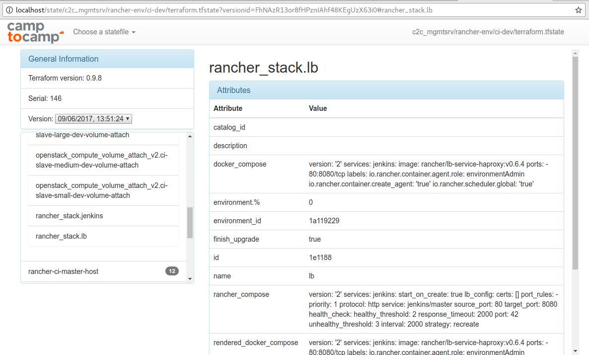

# Terraboard

Web Dashboard to inspect Terraform States




## Use with Docker

```shell
$ docker run -d -p 80:80 \
   -e AWS_REGION=<AWS_DEFAULT_REGION> \
   -e AWS_ACCESS_KEY_ID=<AWS_ACCESS_KEY_ID> \
   -e AWS_SECRET_ACCESS_KEY=<AWS_SECRET_ACCESS_KEY> \
   -e AWS_BUCKET=<terraform-bucket> \
   camptocamp/terraboard:latest
```

and point your browser to http://localhost


## Install from source

```shell
$ go get github.com/camptocamp/terraboard
```

## Development


### Testing

```shell
$ docker-compose build && docker-compose up -d
# Point your browser to http://localhost
```


