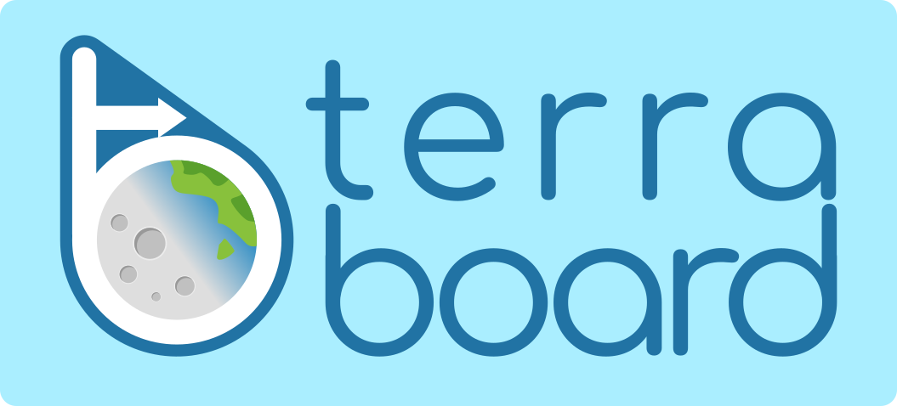

# Terraboard

Website: [https://camptocamp.github.io/terraboard](https://camptocamp.github.io/terraboard)



🌍 📋 A web dashboard to inspect Terraform States


[](https://hub.docker.com/r/camptocamp/terraboard/)
[](https://goreportcard.com/report/github.com/camptocamp/terraboard)
[](https://gitter.im/camptocamp/terraboard)
[](https://travis-ci.org/camptocamp/terraboard)
[](https://coveralls.io/github/camptocamp/terraboard?branch=master)
[](http://www.camptocamp.com)

## What is it?

Terraboard is a web dashboard to visualize and query
[Terraform](https://terraform.io) states. It currently features:

- an overview page listing the most recently updated state files with their
  activity
- a state page with state file details, including versions and resource
  attributes
- a search interface to query resources by type, name or attributes
- a diff interface to compare state between versions

It currently only supports S3 as a remote state backend, and dynamoDB for
retrieving lock informations.


### Overview

The overview presents all the state files in the S3 bucket, by most recent
modification date.


### Search

The search view allows to find resources by various criteria.


### State

The state view presents details of a Terraform state at a given version.


### Compare

From the state view, you can compare the current state version with another
version.


### Requirements

Terraboard currently supports getting the Terraform states from AWS S3. It
requires:

* A **versioned** S3 bucket name with one or more Terraform states,
  named with a `.tfstate` suffix
* AWS credentials with the following rights on the bucket:
   - `s3:GetObject`
   - `s3:ListBucket`
   - `s3:ListBucketVersions`
   - `s3:GetObjectVersion`
* A running PostgreSQL database
* If you want to retrieve lock states
  [from a dynamoDB table](https://www.terraform.io/docs/backends/types/s3.html#dynamodb_table),
  you need to make sure the provided AWS credentials have `dynamodb:Scan` access to that
  table.

## Configuration

Terraboard currently supports configuration in three different ways:

1. Environment variables
2. CLI parameters
3. Configuration file (YAML). A configuration file example can be found in the root directory of this repository.

The precedence of configurations is as described below.

### Available parameters

|CLI|ENV|YAML|Description|Default|
|---|---|----|-----------|-------|
|`-V` or `--version`| - | - | Prints version | - |
|`-p` or `--port`|`TERRABOARD_PORT`|`web.port`|Port to listen on| 8080 |
|`-c` or `--config-file`|`CONFIG_FILE`|-|Config File path| - |
|`-l` or `--log-level` | `TERRABOARD_LOG_LEVEL` | `log.level` | Set log level (debug, info, warn, error, fatal, panic) | info |
|`--log-format` | `TERRABOARD_LOG_FORMAT` | `log.format` | Set log format (plain, json) | plain |
|`--db-host` | `DB_HOST` | `db.host` | Database host | db |
|`--db-port` | `DB_PORT` | `db.port` | Database port | 5432 |
|`--db-user` | `DB_USER` | `db.user` | Database user | gorm |
|`--db-password` | `DB_PASSWORD` | `db.password` | Database password | - |
|`--db-name` | `DB_NAME` | `db.name` | Database name | gorm |
|`--db-sslmode` | `DB_SSLMODE` | `db.sslmode` | SSL mode enforced for database access (require, verify-full, verify-ca, disable) | require |
|`--no-sync` | - | `db.no-sync` | Do not sync database | false |
|`--sync-interval` | - | `db.sync-interval` | DB sync interval (in minutes) | 1 |
|`--dynamodb-table` | `AWS_DYNAMODB_TABLE` | `aws.dynamodb-table` | AWS DynamoDB table for locks | - |
|`--s3-bucket` | `AWS_BUCKET` | `aws.bucket` | AWS S3 bucket | - |
|`--key-prefix` | `AWS_KEY_PREFIX` | `aws.key-prefix` | AWS Key Prefix | - |
|`--file-extension` | `AWS_FILE_EXTENSION` | `aws.file-extension` | File extension of state files | .tfstate |
|`--base-url` | `TERRABOARD_BASE_URL` | `web.base-url` | Base URL | / |
|`--logout-url` | `TERRABOARD_LOGOUT_URL` | `web.logout-url` | Logout URL | - |

## Use with Docker

Either use the included docker-compose file, or run two containers from the commandline:
the app itself and a PostgreSQL database for it to store information in.

```shell
# Set AWS credentials as environment variables:
export AWS_ACCESS_KEY_ID=<access_key>
export AWS_SECRET_ACCESS_KEY=<access_secret>
# Spin up the two containers and a network for them to communciate on:
docker network create terranet
docker run --name db \
  -e POSTGRES_USER=gorm \
  -e POSTGRES_DB=gorm \
  -e POSTGRES_PASSWORD="<mypassword>" \
   --net terranet \
  --restart=always postgres -d
docker run -p 8080:8080 \
 -e AWS_REGION="<region>" \
 -e AWS_ACCESS_KEY_ID="${AWS_ACCESS_KEY_ID}" \
 -e AWS_SECRET_ACCESS_KEY="${AWS_SECRET_ACCESS_KEY}" \
 -e AWS_BUCKET="<bucket>" \
 -e AWS_DYNAMODB_TABLE="<table>" \
 -e DB_PASSWORD="<mypassword>" \
 --net terranet \
 camptocamp/terraboard:latest
```

Then point your browser to http://localhost:8080.

To use the included compose file, you will need to configure an [OAuth application](https://developer.github.com/apps/building-oauth-apps/).

Configuration file can be provided to the container using a [volume](https://docs.docker.com/compose/compose-file/#volumes) or a [configuration](https://docs.docker.com/compose/compose-file/#configs).

## Use with Rancher

[Camptocamp's Rancher Catalog](https://github.com/camptocamp/camptocamp-rancher-catalog)
contains a Terraboard template to automate its installation in Cattle.


## Authentication and base URL

Terraboard does not implement authentication. Instead, it is recommended to use
an authentication proxy such as [oauth2_proxy](https://github.com/bitly/oauth2_proxy).

If you need to set a route path for Terraboard, you can set a base URL by
passing it as the `BASE_URL` environment variable.

When using an authentication proxy, Terraboard will retrieve the logged in
user and email from the headers passed by the proxy.
You can also pass a `TERRABOARD_LOGOUT_URL` parameter to allow users to
sign out of the proxy.


## Install from source

```shell
$ go get github.com/camptocamp/terraboard
```

## Compatibility Matrix

|Terraboard|Max Terraform version|
|----------|---------------------|
| 0.15.0   |  0.12.7             |
| 0.16.0   |  0.12.7             |
| 0.17.0   |  0.12.18            |
| 0.18.0   |  0.12.18            |
| 0.19.0   |  0.12.20            |


## Development

### Architecture

Terraboard is made of two components:

#### A server process

The server is written in go and runs a web server which serves:

  - the API on known access points, taking the data from the PostgreSQL
    database
  - the index page (from [static/index.html](static/index.html)) on all other
    URLs

The server also has a routine which regularly (every 1 minute) feeds
the PostgreSQL database from the S3 bucket.

#### A web UI

The UI is an AngularJS application served from `index.html`. All the UI code
can be found in the [static/](static/) directory.


### Testing

```shell
$ docker-compose build && docker-compose up -d
# Point your browser to http://localhost
```

### Contributing


See [CONTRIBUTING.md](CONTRIBUTING.md)


## Terraboard Logo

The Terraboard logo is based on [an image by Daniel R. Strebe, CC BY-SA 3.0, 15 August 2011](https://en.wikipedia.org/wiki/Azimuthal_equidistant_projection#/media/File:Azimuthal_equidistant_projection_SW.jpg)
